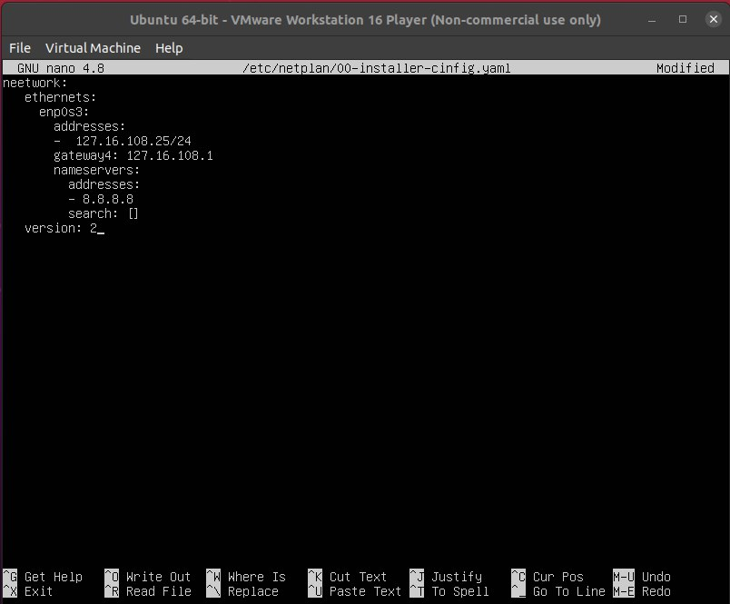

# Week 2
 - Definisikan apa itu Computer Network menurut pemahamanmu
 - Buatlah daftar perintah linux yang membantumu untuk memanagement linux server
 - Ganti IP server lama menjadi IP server baru
 - Lakukan remote server tersebut menggunakan IP baru
 - Install aplikasi web server apache di linux server
 - Akses aplikasi web server apache2 menggunakan browser melalui IP
 - Buatlah localtunnel pada web server apache2
 - Akses aplikasi web server apache2 menggunakan localtunnel lewat HP

# Basic Shell and Computer Networking
- computer network adalah bebrapa perangkat yang saling terkoneksi antara satu dengan yang lain
# perintah dasar pada linuk
-  MKDIR adalah perintah untuk membuat 1 directory
.png)
- SUDO adalah perintah untuk menjalankan perintah aplikasi yang membutuhkan akses root
- LS adalah perintah untuk melihat directory kita di linuk, sedangkan DIR adalah perintah untuk melihat directory di CMD 
 .png)
 - CD adalah perintah untuk masuk kedalam directory 
.png)
- CD .. adalah perintah untuk keluar dari directory
.png)
- TOUCH aadalah perintah untuk membuat file baru 
-CP adalah perintah untuk copy dan merubah file
# merubah IP lama ke IP baru
ini adalah IP saya sebelum dirubah 172.16.108.1/24 selanjutnya akan saya rubah menjadi 172.16.108.25/24
.jpeg)

untuk merubah, kta perlu membuat perintah 

maka kita akan dibawa ke laman text editor, setelah masuk ke text editor kita bisa merubah ip dibagian addresses. 

kita bisa kombinasi CTRL+O untuk save dan CTRL+X untuk keluar dari text editor.
untuk mengkonvifirmasi ip kita bisa menggunakan perintah 
sudo netplan apply

