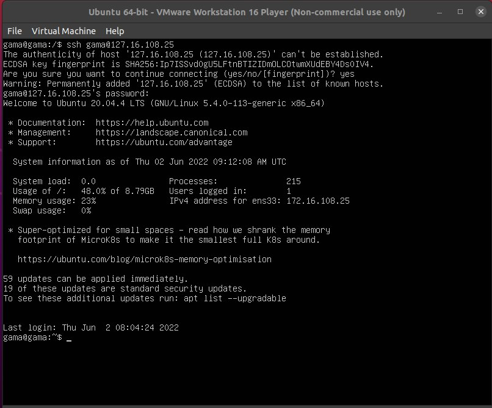

# Week 2
 - Definisikan apa itu Computer Network menurut pemahamanmu
 - Buatlah daftar perintah linux yang membantumu untuk memanagement linux server
 - Ganti IP server lama menjadi IP server baru
 - Lakukan remote server tersebut menggunakan IP baru
 - Install aplikasi web server apache di linux server
 - Akses aplikasi web server apache2 menggunakan browser melalui IP
 - Buatlah localtunnel pada web server apache2
 - Akses aplikasi web server apache2 menggunakan localtunnel lewat HP

# Basic Shell and Computer Networking
- computer network adalah bebrapa perangkat yang saling terkoneksi antara satu dengan yang lain
# perintah dasar pada linuk
-  MKDIR adalah perintah untuk membuat 1 directory
.png)
- SUDO adalah perintah untuk menjalankan perintah aplikasi yang membutuhkan akses root
- LS adalah perintah untuk melihat directory kita di linuk, sedangkan DIR adalah perintah untuk melihat directory di CMD 
 .png)
 - CD adalah perintah untuk masuk kedalam directory 
.png)
- CD .. adalah perintah untuk keluar dari directory
.png)
- TOUCH aadalah perintah untuk membuat file baru 
-CP adalah perintah untuk copy dan merubah file
# merubah IP lama ke IP baru
ini adalah IP saya sebelum dirubah 172.16.108.1/24 selanjutnya akan saya rubah menjadi 172.16.108.25/24
.jpeg)

untuk merubah, kta perlu membuat perintah 

maka kita akan dibawa ke laman text editor, setelah masuk ke text editor kita bisa merubah ip dibagian addresses. 

kita bisa kombinasi CTRL+O untuk save dan CTRL+X untuk keluar dari text editor.
untuk mengkonvifirmasi ip kita bisa menggunakan perintah 
SUDO netplan apply
untuk memastikan IP sudah berubah bisa menggunakan 
IP a

# Remote server menggunakan IP baru
buka terminal lakukan perintah 
SSH gama@172.16.108.25

# Install aplikasi web server apache di linux server

pertama instal apache2 dengan melakukan perintah 
`sudo apt install apache2`

jika proses penginstalan selesai, kita bisa cek statatus apache dengan mengetik perintah
 `sudo systemctl status apache2`
.
apabila sudah aktif bisa kita cek di browser dengan mengetik IP server 

apabila tampilan sudah seperti diatas maka ip server sudah berhasil terinstal

# Buatlah localtunnel pada web server apache2
Localtunel adalah toos yang memungkinkan kita untuk berbagi layanan lokal ke publik dengan url yang disediakan oleh url localtunel.

pertama tama kita akan menginstal node.js menggunakan nvm dengan melakukan perintah
`sudo apt install curl`

`curl -o- https://raw.githubusercontent.com/nvm-sh/nvm/v0.39.1/install.sh | bash`

`exec bash`
`nvm install 14`
`node -v`
